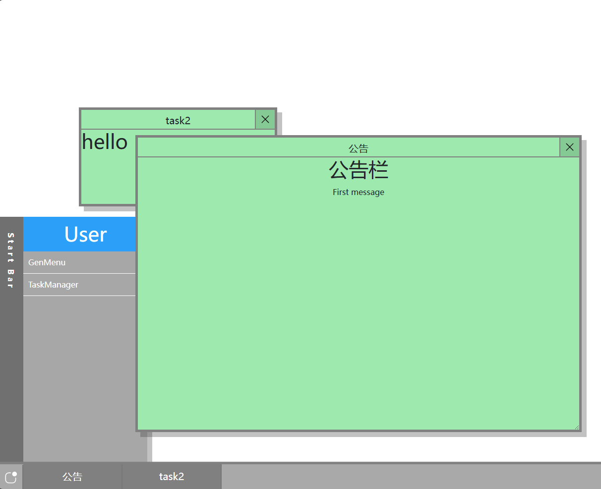

# LiteWebWindow Project

`ver 0.2.1`

A lightweight window simulation front-end.

*Also my first frontend program.*

Modify taskList var in main.js to add some new window (current usage method)

---

## Current plan

* First runnable version ***(Done)***
* taskList var change to better format ***(Done)***
* Add StartMenu. Just StartMenu **:\(** **(New)** ***(Done)***
* Interactive addition of window functionality ***(In progress)***
* Window style control **(Future)**
* More template window style **(Future)**
* Add Task Manager whose can Close/Minimize/TopUp/Control the window ***(Long Future)***
* Add lots of functionality whose they support SQL and other backend API.***(Long Long Future)***
* ***Long Long Long is too long***
etc....

## Project Preview

This project uses [Vue](https://github.com/vuejs/core "official github website") framwork and [Bootstrap v5](https://github.com/twbs/bootstrap "official github website")

Require `node v22.12.0(Dev env)`.Enter project directory and usage `npm install` to install dependency package.

致 太阳人——羿
