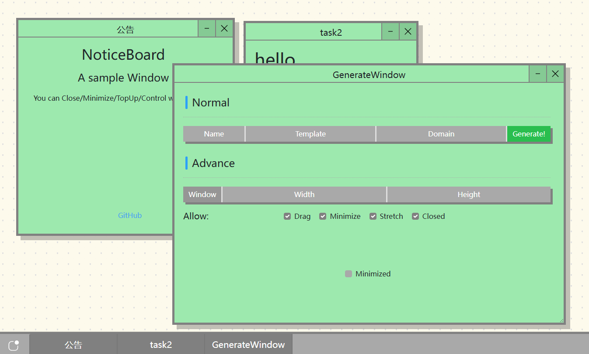

# LiteWebWindow Project

`ver 0.2.5`

A lightweight window simulation front-end.

*Also my first frontend program.*

Modify taskList var in main.js to add some new window (current usage method)

## Current plan

* First runnable version ***(Done)***
* taskList var change to better format ***(Done)***
* Interactive addition of window functionality ***(Done!)***
  * Add StartMenu. ***(Done)***
  * Add Close Window Button ***(Done)***
  * Add Generate Window ***(Done)***
* Window style control ***(Future)***
* More template window style ***(LongFuture)***
* Add Task Manager whose can Close/Minimize/TopUp/Control the window ***(Long Long Future)***
* ***Long Long Long is too long***
* etc....

## Project Preview




## Documents

If you want to add new window with js api:Usage `GenerateWindow(attr<Dict Array>), addToTaskBar(window_name<str>,minimized<boolean>)` functions in `./src/assets/js/EventRegistrationTool/window.js`
The structure of attr is as follows:

```js
"WindowName":str // Just like that name (The current version does not support including spaces)
"TemplateName":str //File name in components floader
"DomainName":str //File name in components/windowDomain floader
"WindowWidth":str //default window width like "500px","50%"
"WindowHeight":str //same
"allowDrag":boolean //Decided whether the window allows dragging or not
"allowMinimize":boolean // same
"allowStretch"：boolean //same
"allowClose":boolean //same
"minimized":boolean //Decided whether the initial state is minimized or not
"data":any //Parameters reserved for some windows
```

Tips: The `window_name` parameter passed in `addToTaskBar` needs to be consistent with the value of `attr ['WindowName']` passed in `GeneratedWindow`.

## Required

This project uses [Vue](https://github.com/vuejs/core "official github website") framwork , [Bootstrap v5](https://github.com/twbs/bootstrap "official github website"), jQuery

Require `node v22.12.0(Dev env)`.Enter project directory and usage `npm install` to install dependency package.

致 太阳人——羿
